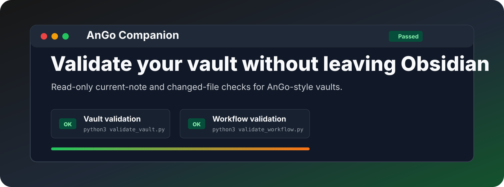
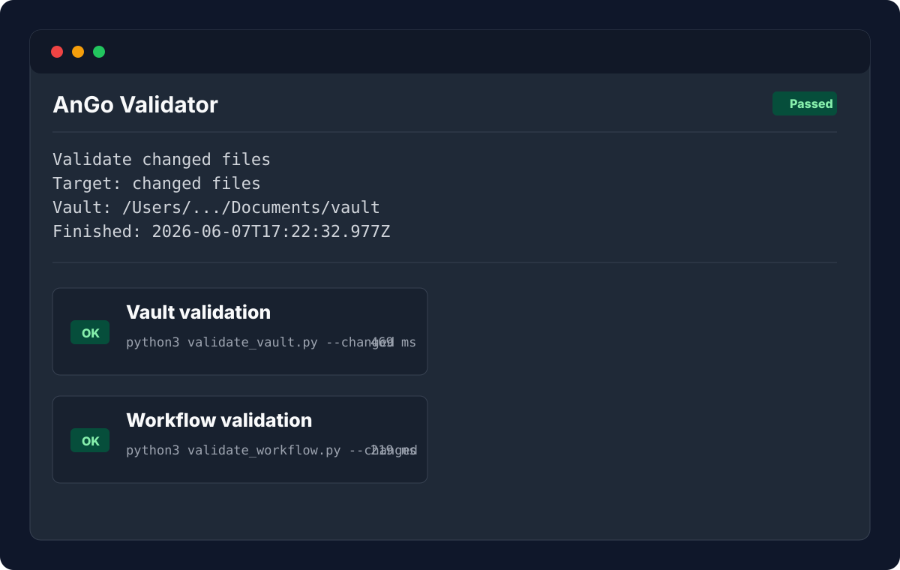

<p align="center">
  
</p>

<p align="center">
  <a href="https://github.com/viggomeesters/obsidian-ango-companion/releases/latest"></a>
  <a href="LICENSE"></a>
  
  
  
</p>

# AnGo Companion

AnGo Companion is a desktop-only Obsidian plugin that runs local vault validation commands from inside Obsidian and displays the result in a dedicated side pane. It is built for Life OS / AnGo-style vaults that already include the validation scripts.



## Features

- Adds `AnGo: Validate current note`.
- Adds `AnGo: Validate changed files`.
- Runs the existing vault validators from the configured vault root.
- Shows command status, duration, stdout, stderr, and failure details in an Obsidian view.
- Summarizes validation runs with error/warning counts, failed validators, highlighted findings, copy buttons, and links to referenced vault files when they can be resolved safely.
- Remembers the last validation run so reopening the pane keeps useful context available.
- Opens the AnGo context note and schema from commands.
- Stays read-only: it does not create, modify, fix, stage, or commit vault files.

## Requirements

AnGo Companion runs on desktop Obsidian because it spawns local Python processes. It does not bundle AnGo validators; it calls the validators that already live in your vault.

AnGo Companion expects these scripts to exist in the target vault:

```text
system/scripts/vault/validate_vault.py
system/scripts/vault/validate_vault_workflow.py
```

The plugin runs:

```bash
python3 system/scripts/vault/validate_vault.py <target>
python3 system/scripts/vault/validate_vault_workflow.py <target>
```

For changed-file validation, `<target>` is `--changed`. For current-note validation, `<target>` is the active Markdown file path.

## Privacy

AnGo Companion does not make network requests and does not send vault content to external services. Validation happens locally by spawning the configured Python command from the configured vault root.

## Installation

### Community plugin directory

AnGo Companion is structured for Obsidian Community plugin submission. Once accepted, it can be installed from **Settings -> Community plugins -> Browse** inside Obsidian.

### Manual installation

Until the community directory submission is accepted:

1. Download `main.js`, `manifest.json`, and `styles.css` from the [latest release](https://github.com/viggomeesters/obsidian-ango-companion/releases/latest).
2. Create this folder in your vault: `.obsidian/plugins/ango-companion/`.
3. Put the downloaded files in that folder.
4. Reload Obsidian.
5. Enable **AnGo Companion** in **Settings -> Community plugins**.

### BRAT installation

For beta testing, install the plugin with [BRAT](https://github.com/TfTHacker/obsidian42-brat) using this repository URL:

```text
https://github.com/viggomeesters/obsidian-ango-companion
```

## Settings

- **Python command**: defaults to `python3`.
- **Vault root override**: optional. Leave empty to use the current Obsidian vault path.
- **Remember last validation run**: enabled by default. Stores the last local validation output in the plugin's Obsidian data so the pane can restore it after reopening.

If Obsidian cannot expose the current vault path on your platform, set **Vault root override** to the absolute path of the AnGo-style vault that contains `system/scripts/vault/validate_vault.py` and `system/scripts/vault/validate_vault_workflow.py`.

## Troubleshooting

- **Missing script**: confirm that the configured vault root contains both required validator scripts under `system/scripts/vault/`.
- **Python command not found**: set **Python command** to the full path of your Python executable.
- **Wrong vault**: set **Vault root override** when the validators should run against a different vault than the one currently open in Obsidian.
- **Validation fails**: inspect the output pane. The plugin shows the exact command, duration, stdout, stderr, and exit status so the same command can be reproduced in a terminal.
- **Sensitive output**: disable **Remember last validation run** if validator output may contain details you do not want stored in plugin data.

## Development

```bash
npm install
npm run build
npm run typecheck
OBSIDIAN_VAULT_ROOT="/path/to/your/vault" npm run install:vault
```

For local development, run `npm run build` and set `OBSIDIAN_VAULT_ROOT` when running `npm run install:vault`. The install script copies the release assets into `.obsidian/plugins/ango-companion/` inside that vault.

## Release process

Obsidian installs community plugin files from GitHub releases. For each release:

1. Update `manifest.json`, `package.json`, and `versions.json`.
2. Run `npm install`, `npm run build`, and `npm run typecheck`.
3. Create a GitHub release whose tag exactly matches `manifest.json.version`.
4. Attach `main.js`, `manifest.json`, and `styles.css` as release assets.

## Community directory submission

The repository is prepared for Obsidian Community plugin submission. The remaining submission step must be completed by the repository owner in the Obsidian Community site because it requires signing in, linking GitHub, and confirming the developer policies/support commitment.

Submit this repository URL:

```text
https://github.com/viggomeesters/obsidian-ango-companion
```

Official references:

- [Submit your plugin](https://docs.obsidian.md/Plugins/Releasing/Submit%20your%20plugin)
- [Obsidian releases repository](https://github.com/obsidianmd/obsidian-releases)

## License

[MIT](LICENSE)
